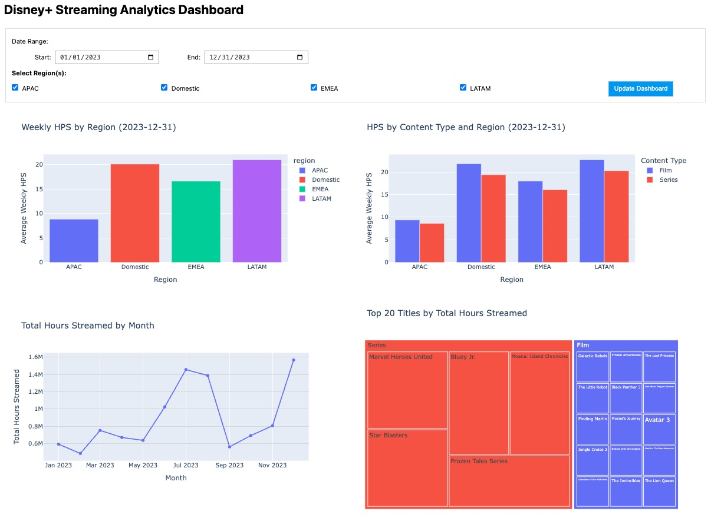
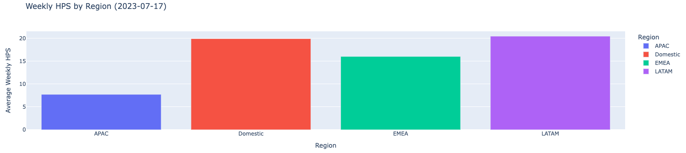
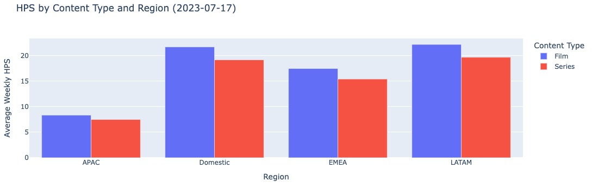
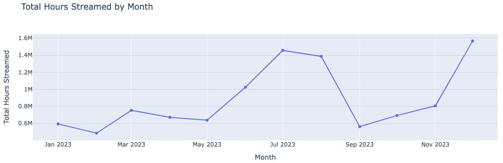
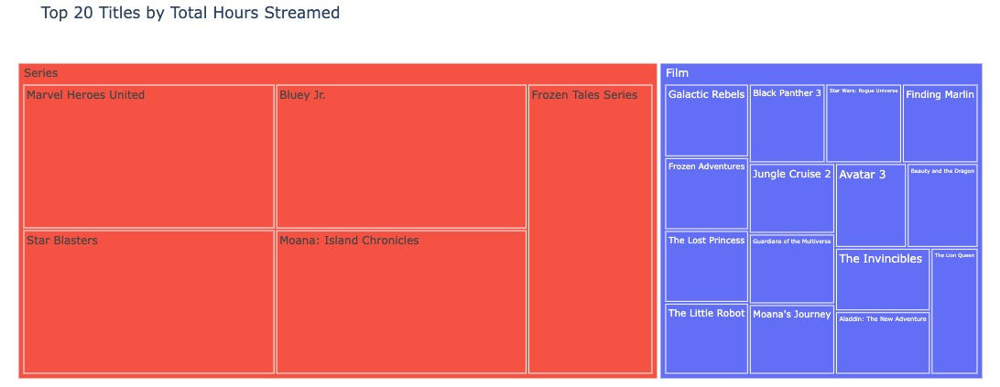

# Disney+ Streaming Analytics Dashboard

## Project Overview
An interactive dashboard analyzing streaming patterns across regions and content types using synthetic Disney+ data for 2023.



## Data Description
This analysis uses synthetic streaming data with:
- ~4.5 million rows covering the full year 2023
- 100,000 unique subscribers
- 100 series (with 1-10 seasons) and 30 films
- Columns: business_date, account_id, region, content_type, full_title, hours_streamed

## Data Generation
The repository does not include the full dataset due to size constraints. Instead, you can generate the data locally:

1. Run the data generation notebook:
```bash
jupyter notebook streaming_data_csv_creation.ipynb
```

2. Execute all cells in the notebook to generate `disney_plus_streaming_data.csv`

The generator creates realistic synthetic viewing patterns with:
- Regional differences (Domestic, EMEA, APAC, LATAM)
- Content type patterns (Films watched ~1.4x more than Series)
- Seasonal viewing trends throughout 2023
- Calibrated engagement levels based on actual streaming behaviors

**Note:** The generated CSV will be approximately 312MB with 4.5 million rows. Make sure you have sufficient disk space.

## Key Insights
- Region "Domestic" shows highest engagement at ~20 HPS (Hours Per Subscriber)
- Films consistently outperform series across all regions
- Viewing patterns show clear seasonal trends with peaks during summer months
- APAC region shows significantly lower engagement compared to other regions

## Visualization Techniques
This dashboard implements multiple interactive visualization techniques:
1. **Bar Charts**: For comparing HPS across regions and content types
2. **Time Series**: For tracking engagement trends over time
3. **Heatmaps**: For identifying peak streaming periods
4. **Treemaps**: For ranking top content by viewing hours

## Technologies Used
- **Data Processing**: Python, Pandas, Pandas-SQL
- **Visualization**: Plotly for interactive charts
- **Dashboard Framework**: Jupyter Widgets for interactivity
- **Why Plotly?**: Chosen for its robust interactivity, easy integration with Pandas, and browser-based rendering capabilities

## Running This Project Locally

### Prerequisites
```bash
pip install pandas plotly ipywidgets jupyter
```

### Instructions
1. Clone this repository
2. Navigate to the project directory
3. Run `jupyter notebook`
4. Open `engagement_analysis.ipynb`
5. Run all cells to generate the interactive dashboard

## Dashboard Snapshot


*Complete view of the Disney+ Streaming Analytics Dashboard with all interactive components*

This interactive dashboard provides comprehensive streaming analytics across regions and content types. The dashboard features date range selection (top), region filtering (checkboxes), and four key visualization components that update simultaneously based on selected filters.

## Dashboard Components

### Weekly HPS by Region

*Bar chart showing average Hours Per Subscriber across four geographic regions: APAC (~9 hours), Domestic (~20 hours), EMEA (~17 hours), and LATAM (~21 hours)*

### HPS by Content Type and Region

*Grouped bar chart comparing film vs. series engagement by region. Films (blue) consistently show higher engagement than series (red) across all regions*

### Total Hours Streamed by Month

*Line chart showing overall streaming hours throughout 2023, with peak viewing periods highlighted during winter months and summer holiday seasons*

### Top Titles by Hours Streamed

*TreeMap visualization showing most-watched content with proportional viewing metrics. Popular series like "Marvel Heroes United" dominate the viewing landscape*

## Interactive Features Demonstrated

The dashboard provides several interactive capabilities:
- **Filtering**: Users can select specific regions and date ranges
- **Cross-filtering**: All charts update simultaneously when filters are applied
- **Tooltips**: Hovering over any chart element reveals detailed metrics
- **Sorting**: Content tables can be sorted by different metrics
- **Zooming**: Time series charts support zoom/pan functionality for detailed analysis

This modular design allows viewers to quickly identify patterns while also enabling deep-dive analysis into specific regions, time periods, or content types.

## Results & Insights

### 7.1 Technical Summary

This interactive dashboard combines four complementary visualization types to create a comprehensive analysis system using Plotly and ipywidgets:
* Bar charts for regional performance comparison
* Grouped bar charts for content type analysis
* Line charts for temporal trends
* Treemaps for hierarchical content performance

Key implementation features include modular visualization functions, consistent styling, and interactive filtering controls that allow stakeholders to explore patterns dynamically rather than through static reports.

Potential extensions could include geographic mapping, automated statistical analysis, or deployment as a standalone web application.

### 7.2 Business Insights & Recommendations

**Key Insights**

Regional Engagement
* **LATAM** and **Domestic** markets show highest engagement at **21** and **20** average weekly HPS respectively
* **APAC** shows significantly lower engagement compared to other regions (less than half of LATAM)

Content Type Performance
* **Film content** consistently outperforms series engagement across all regions by approximately **1.2x**
* This content type advantage is most pronounced in **LATAM** and **Domestic** markets

Seasonal Patterns
* Strong summer engagement peaks during **June**, **July**, and **August**
* Second significant engagement spike in **December** around holiday season
* **January** and **September** represent the lowest engagement periods

Content Analysis
* Series remain important despite lower overall engagement rates
* Top series performers include **Marvel Heroes United**, **Bluey Jr.**, and **Star Blasters**
* Film category shows more diversified viewership across multiple titles

**Strategic Recommendations**

1. **Counter Post-Summer Drop**: Implement targeted promotion campaign in September to mitigate the engagement decline after summer viewing peaks

2. **Content Investment Rebalancing**:
   * Maintain film investment as our engagement foundation
   * Increase investment in high-performing series franchises to build sustained engagement

3. **Regional Focus**:
   * Investigate causes of low APAC engagement and develop region-specific content strategy
   * Leverage the success patterns from LATAM to other markets where applicable

4. **Seasonal Planning**:
   * Align major content releases with natural engagement dips in January and September
   * Enhance content offerings during peak viewing periods to maximize engagement